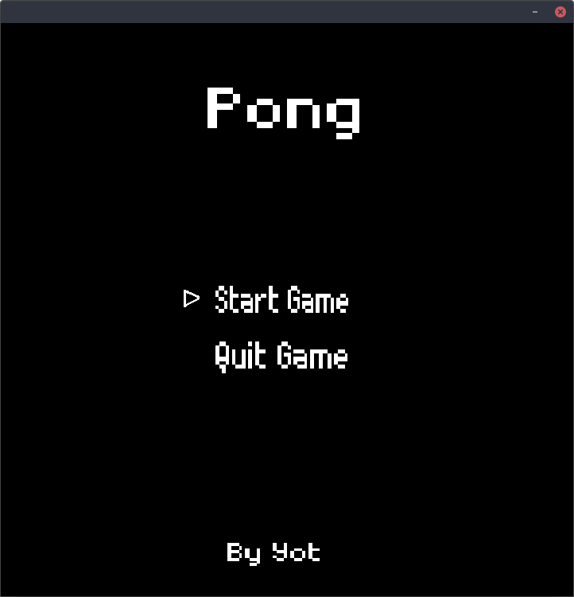
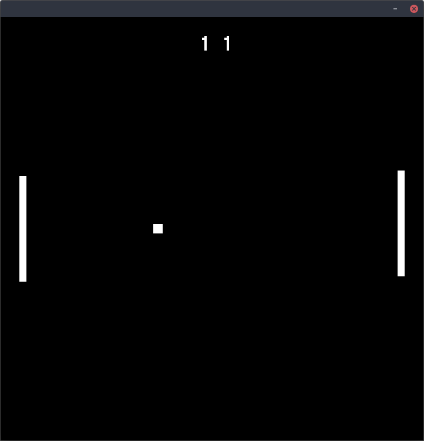
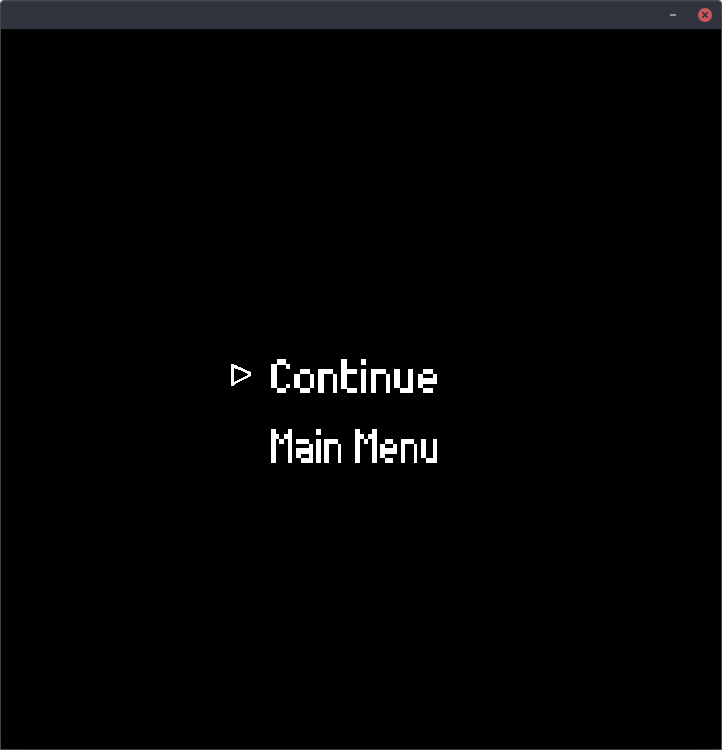

# pong
Pong made in C++ </br>
Latest version: 1.3

## Features
- An infinite pong game
- A pause menu while in game
- A main menu
- Bonus

## Images




## Pre-made files
If you don't want to build pong by yourself, you can download pre-compiled binaries on the release page:</br>
https://github.com/Yot360/pong/releases/latest

#### Windows:
Extract the .zip and run pong.exe

#### macOS
Run the run_once_before.command file with right click->Open, and then run the pong app

#### Nintendo Switch Homebrew App
Get the .nro file from the release

## Building
### ArchLinux
To build on arch: </br>
First install dependencies:
```
sudo pacman -Syu sdl2 sdl2_ttf sdl2_mixer base-devel git
```
```
git clone https://github.com/Yot360/pong.git
makepkg
cd build && ./pong
```

### Other Linux
I did not make packages for other linux ditros so:
```
git clone https://github.com/Yot360/pong.git
sh build_linux.sh
```

### Windows
On Windows, open the project in VS and add SDL libraries manually.</br>
This video can help setting up everything: https://www.youtube.com/watch?v=tmGBhM8AEj8
